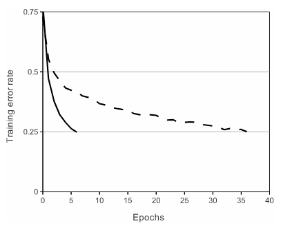
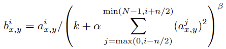
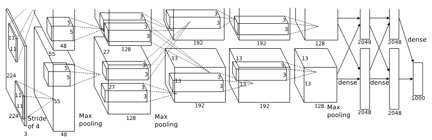
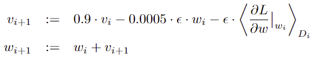

## 서론
정량적인 CNN의 시작이라고 생각할 수 있는 AlexNet을 살펴보자!

# ImageNet Classification with Deep Convolutional Neural Networks

## 초록
ImageNet LSVRC-2010 대회에서 1등 했다.

신경망은 6천만 개의 파라미터와 65개의 뉴런을 가짐, 다섯 개의 Convolution 계층(몇 개는 pooling 계층이 따라옴)과 3개의 완전-연결 계층, 마지막에 softmax 계산을 한다.

Dropout을 적용하여 과적합을 방지했고 성능향상을 이끌어냈다.

## 모델 구조
AlexNet이 **새롭게 도입한 기술**들을 정리해보겠다.    
기본 CNN 구조는 [나중에 추가 예정] 여기서 확인하길 바란다.

### ReLU NonLinearity
ReLU 활성화 함수를 사용하여 기존의 사용하던 tanh 보다 **학습 속도를 6배** 가량 증가시켰다.

### Training on Multiple GPUs
GPU 한 개로는 데이터 셋 전부를 학습하지 못하였다. 이러하여 GPU 2개를 가지고 2개의 neural net으로 분리하여 학습을 진행했고 GPU끼리 상호 메모리 접근이 가능하여 정보 교환도 가능하였다.

이를 통해 오차를 줄일 수 있었다.    
top-1 오차율 : 1.7%, top-5 오차율 : 1.2%  

### Local Response Normalization
인접한 다른 feature map 채널에 비해 해당 feature map의 값이 너무 크거나 작은 것을 방지하기 위해 사용함

   
$k = 2$   
$n =5$   
$α = 10^{-4}$   
$β = 0.75 $

이를 통해 오차를 줄일 수 있었다.    
top-1 오차율 : 1.4%, top-5 오차율 : 1.2% 

### Overlapping Pooling CNN
CNN의 풀링 계층은 전통적으로 겹치지 않게 설계되어 있다. 하지만 AlexNet은 겹치게 했다.

stride = 2, padding_filter size = 3x3

이를 통해 오차를 줄이며 과적합을 방지할 수 있었다.    
top-1 오차율 : 0.4%, top-5 오차율 : 0.3% 

### 전체 모델 구조

5개의 Convolution 계층과 3개의 완전-연결 계층으로 구성되어있다.

2번째, 4번째, 5번째 Convolution 계층은 **동일한 GPU**에 있는 feature맵(커널맵)에만 연결된다.

3번째 Convolution 계층은 모든 feature맵(커널맵)을 사용한다.

완전-연결 계층은 모든 뉴런과 연결되어 있다.

LRN은 1번째, 2번째 Conv 계층 뒤에서 사용되고    
Max pooling 1번째, 2번째, 5번째 Conv 계층 뒤에서 사용된다.   
ReLU는 모든 계층에 적용된다.

## 과적합 줄이기(일반화)
### 데이터 증강
1. 수평반사와 팽행이동
2. RGB 픽셀의 집합에 주성분 분석 수행

### Dropout
1번째, 2번째 완전-연결 계층에 Dropout을 적용한다.   
p = 0.5

## 학습 디테일
- batch_size = 128
- 모멘텀 = 0.9
- 가중치 감쇠 = 0.0005

### 가중치 갱신 규칙

- $v$ = 모멘텀
- $ε$ = 학습률

## 결과
- Dropout 중요함
- 앙상블 학습 해봤음 -> 성능 좋아지지만 많이 좋아지지는 않음
