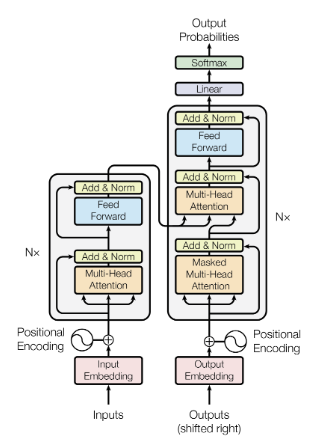
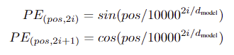
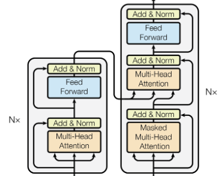
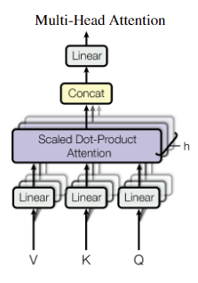
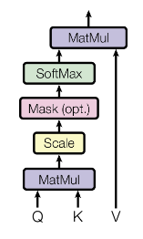
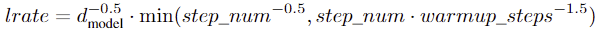

## 서론
LLM 모델들의 근본이라고 생각할 수 있는 Transformer 모델을 살펴보자!

# Attention Is All You Need

## 초록
오직 어텐션 알고리즘만을 사용하는 아키텍쳐 Transformer를 제안한다.

## 모델 구조

### 입력
논문 속 Transformer 모델은 해석 도메인을 처리하였다. 이에 맞춰 데이터는 자연어로 예를 들어 설명하겠다.

#### 입력 데이터 전처리
```
토큰화 -> 임베딩 -> Positional Encoding(PE)
``` 

- **토큰화** : 단어의 의미상의 뜻으로 나누는 것을 의미함. (논문에 사용된 tokenizer : BPE, WordPiece)
- **임베딩** : 토큰화된 단어에 임의의 고차원 벡터를 부여하는 것을 의미함.
- **PE** : 임베딩 차원에 맞는 벡터를 고유한 단어 위치에 더한다.

    
    
    겹치거나 모델 학습에 영향이 가지 않도록 -1~1 범위를 가진 삼각함수로 더해줄 벡터를 정한다.

데이터 구조 : (batch, sequence, embed_dim)

필요 정보 : vocab : (토큰화된 단어에 각기 다른 인덱스 할당한 정보)

-----
### 모델
#### 인코더 & 디코더


#### Multi-Head Attention


참고) 임베딩 차원을 Head의 개수로 나눠야 함 

데이터 구조 : (batch, n_head, sequence, embed_dim/n_head)

#### Scaled Dot-Product Attention


참고) Mask를 사용한다면 미래의 정보를 참조하지 않기 때문에 해당 시퀀스의 단어만 사용하여 예측을 한다.

#### FFN

간단한 Linear Layer들의 집합으로 입력 차원과 출력 차원이 같다.

예시)
입력 데이터 : (batch, sequence, embed_dim)
hidden layer : (batch, sequence, 2048)      
출력 데이터 : (batch, sequence, embed_dim)

#### 마지막 출력 Linear Layer

마지막 차원을 output vocab 크기로 바꾸는 Layer이다.

예시) (batch, sequence, embed_dim) -> (batch, sequence, vocab_size)

## 학습 설정
**데이터 셋** : WMT 2014 English-German dataset, WMT 2014 English-French dataset

**하드웨어** : 8개의 NVIDIA P100 GPU, 베이스 모델 학습에 100,000 스텝, 큰 모델(?) 학습에 300,000 스텝

**Optimizer** : 

**정규화** : Dropout, Label Smoothing

## 결과 

1. 학습 비용 절감
2. 영어 -> 독일어 BLEU score 28.4
3. 영어 -> 프랑스어 BLEU score 41.0

## 모델 변형
n_head : 적거나 많으면 모델 정확성이 떨어짐 8~16 사이가 적당했음

encoder & decoder, embed_dim, d_ff(FFN hidden 출력 차원 수) : 수를 늘리면 늘릴 수록 성능이 좋아짐

dropout : 확률을 늘리면 성능이 좋아짐 -> 아마 과적합을 방지해 일반화 성능이 좋아진 듯

Label Smoothing : 값을 가감 했을 때의 PPL과 BLEU 성능이 다르게 나옴

## 실습
https://github.com/wonone0106/transformerPractice

출처 : https://arxiv.org/abs/1706.03762
